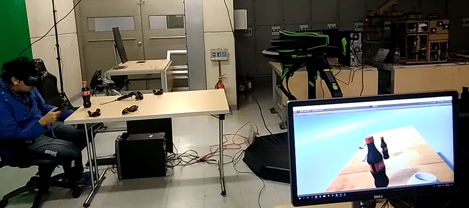
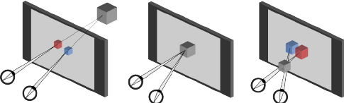
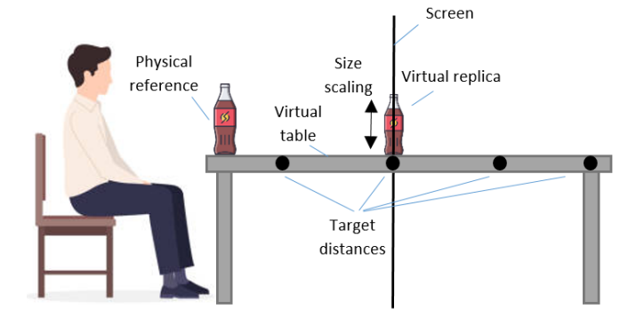
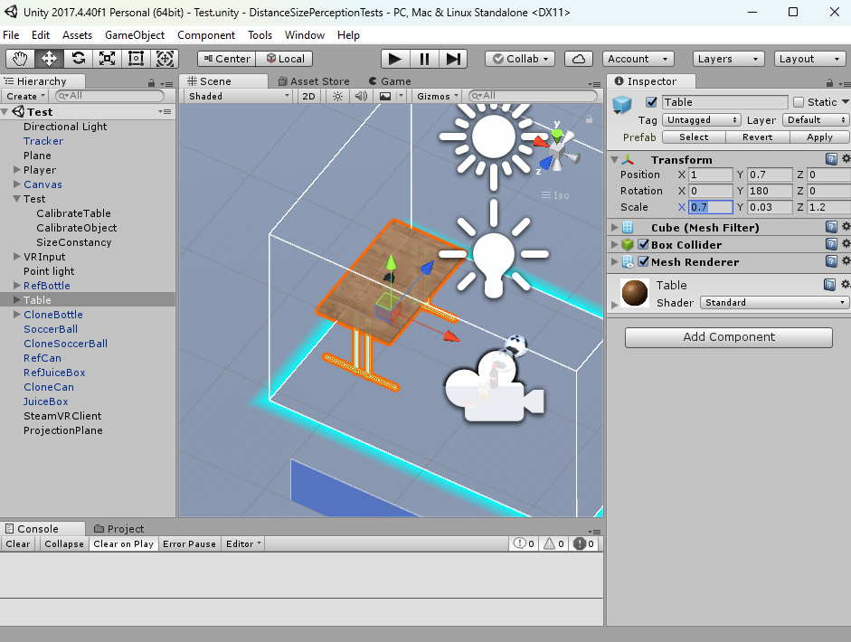
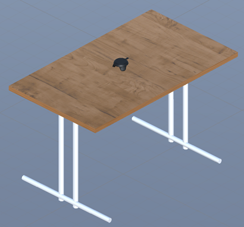
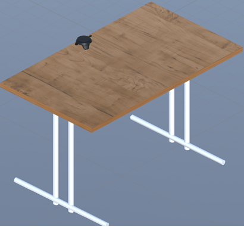
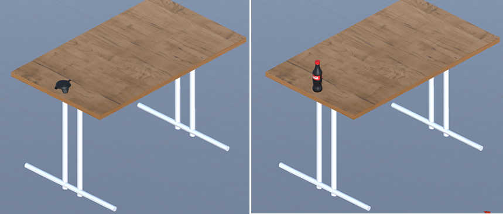

# DistanceSizePerceptionTests - Size Constancy Test

Size constancy is a research application designed to assess the perception of distance and size in virtual reality. Size constancy is a perceptual phenomenon where an object is perceived to be the same size regardless of its distance and the visual angle subtended by the object on the retina. This phenomenon is shaped by experience, so when we approach or walk away from a familiar object, we do not perceive a change in its size, even though its retinal size becomes larger or smaller. This is a result of context, where cues like linear perspective and the relative size of surrounding objects influence the perceived distance of the object. Thus, it is possible to assess distance perception using the relative size of a familiar object as a reference.

Studies have shown that people’s perception of space is distorted in virtual environments compared to the physical world. To perceive space, humans use different depth cues that can be classified as visual (binocular disparity, linear perspective, relative size, retinal blur, motion parallax) and oculomotor cues (accommodation, vergence). By analyzing the relationships between our actions and changes in these cues, the visual system develops the basis to perceive the space around us. Unfortunately, the harmony of these cues is disrupted in VR. For example, in HMDs, when looking at a virtual object, the eyes accommodate to the screen plane but converge based on the apparent location of the object, causing a conflict in the usual relationship between these cues. As a result, the perception of depth is distorted. This problem is known as the vergence-accommodation conflict. Reports describe sensations of depth compression, where distances are systematically underestimated.

## Size-constancy Tests

Participants must estimate the relative size of a familiar object placed over a virtual table at different distances using a physical reference. The reference object is placed at one side and at the same height as the virtual table. Then, some virtual replicas of the reference object are presented with exaggerated dimensions, where the table provides context to estimate the object's distance. Subjects scale the virtual replicas until their size perceptually matches the size of the physical reference. These replicas are located at different target distances, strategically selected to match the zero, positive, and negative stereoscopic parallax conditions.

Under natural conditions, no significant differences in size perception are expected between target distances. However, performance could differ in VR due to the amount of vergence-accommodation conflict induced by the display, which in turn may lead to an apparent shortening of the virtual table due to depth compression. The objective was to allow subjects to touch the physical object, get an overall sense of its dimensions, and use their own body as a reference to perform their estimates. Because proprioception is not influenced by the display, a conflict between the motor/efferent cues and the visual stimulus will be induced. We hypothesized that in the HMD, the perception of size (and distances) would be more negatively impacted than in the CAVE, due to the greater susceptibility of the HMD to induce depth compression.

## Requirements

1. Unity3D version 2017.

2. HTC Vive v1 o Pro. We recommend to use two base stations for better results.

3. A HTC Vive Tracker. 

4. Nvidia GTX 1060 or later / AMD Radeon RX 480 or later

5. A bottle of 750ml of coke (coca-cola) or a Juice Box

6. A table with a length greater than 1.2m and a chair. Ensure that the table is perfectly horizontally leveled with the ground. Use a bubble level intrument if its necessary.

## Getting Started 

1. Download and install the drivers for the HTC Vive: https://www.vive.com/us/setup/vive-pro-hmd.

2. Connect the HTC Vive to your PC, perform the device calibration, and complete the room setup process using SteamVR.

3. Download the project code and open it in Unity3D. Select the ‘Test.scene’ and locate the table object in the scene hierarchy. Assign the dimensions of your table in the scale attribute of the Transform component. Keep in mind that one unit in Unity3D is equivalent to one meter.

4. Before starting, we need to perform the calibration of the table and the reference object. Calibration means replicating their position and orientation in the virtual space. To do this, place the table and chair inside the tracking space of the base stations, ensuring that the entire table is visible to the base stations. Then, place the Vive Tracker at the center of the table.

5. Press play in Unity to start the calibration process and put on your headset. You will see an empty environment, but don’t worry, this is normal. Then, press the trigger button on the Vive Controller. The virtual table will appear and be located at the same position as the tracker in the virtual environment. Don’t worry if the table looks misaligned at first glance.

6. Raise your headset to see the physical table and the Vive Tracker. Place the tracker at the center-left corner of the table and press the trigger. This action will orient the virtual table to match the physical table. Compare the result by raising/lowering the headset and touching the edges of the table with the Vive controllers. If the virtual table looks misaligned with the physical one, slightly move the physical table to match the position or orientation.

7. The next step is to calibrate the reference object (Coke bottle or juice box). Place the tracker a few centimeters from the bottom center of the table and press the trigger. The virtual object will appear at the position of the tracker. Now, remove the tracker, raise the headset, and place the actual object on the table in the same position as in the virtual environment. Move it slightly until its position and orientation match perceptually with the virtual replica.

8. Press the Grip button to switch between the bottle and the juice box. You’ll notice that the virtual replica may look different in size compared to the actual object—this is normal and part of the test. Now, you are ready to perform the test.

9. Sit comfortably in the chair near the reference object, press the trigger, and follow the on-screen instructions. Scale the virtual replica until it perceptually matches the size of the reference object. Use the TouchPad on the Vive controller to increase or decrease its size. Do not raise your headset! Use your hands as a reference to estimate the size of the object. Use proprioception by touching the object and the table. Adjust the size of the replica accordingly until you feel both are the same size. Once you feel confident with the size, press the trigger.

10. Follow the on-screen instructions; you will estimate the size of the object at three different target distances multiple times.

11. That’s it! It is advisable to perform this test twice to facilitate the adaptation process. Use different objects to prevent learning effects alternating between the bottle and the juice box. At the end, you will find your performance results in the folder ‘data’. 

## Paper

More information about this study and its results can be found in https://sam.ensam.eu/handle/10985/13717. 

A video of the experimental setup and protocol can be found here: https://www.youtube.com/watch?v=p7Tpy1GYTuo

## Credits

Developed by Jose L. Dorado (jl.dorado59@uniandes.edu.co,  jl-dorado@hotmail.com). 

PhD thesis directed by Pablo Figuero (pfiguero@uniandes.edu.co), Jose Tiberio Hernandez (jhernand@uniandes.edu.co), Frederic Merienne (frederic.merienne@ensam.eu), Jean Remmy Chardonnet (jean-remy.chardonnet@ensam.eu)

Copyright 2019 © Grupo Imagine Uniandes
https://imagine.uniandes.edu.co